# 1. Introduction

This project is focused on showing one of the basic cybersecurity attack:
web parameter tampering. This project is focused on WPT, so other
vulnerabilities like storing user id and token in local storage, not using
ssl certificates, etc. are not considered. There is also switch on the navbar
that enables switching between safe and unsafe version of application. 

# 2. What is web parameter tampering

Web parameter tampering is a type of web-based cyberattack in which certain 
parameters in a request sent to API are changed in a way that is not expected
by the server.

# 3. Local setup

## 3.1 Requirements
- Docker version 20.10.18
- docker-compose version 1.29.2

Project was developed with these versions of docker, but previous versions
should also work.

## 3.2 Steps

1. Download this repository
2. Run `./build_wpt` which downloads and builds required docker images(it may
take a moment)
3. Run `./run_wpt` which builds db and starts both frontend and backend
application. It may need rerun after first time, because of db building
while backend depends on it
4. Run `./load_demo_data` to load demo data

Now frontend app should be accessible at `http://localhost:3000` and backend at
`http://localhost:8000/`.

# 4. Demo

Application imitates web page of music festival. User can buy tickets or if
interested in acquiring press accreditation, user can create account and
apply for accreditation. Once accreditation is accepted by admin, user can see
accreditation code which allow user to attend festival as a press member.

## 4.1 Accreditation theft

### 4.1.1 Scenario in unsafe version of app

First we want to log in as the hacker(username: `hacker`,
password: `Demo1234!`). We need to go to `/press` and log in with hacker's
credentials. Ensure that unsafe version of application is now selected.

  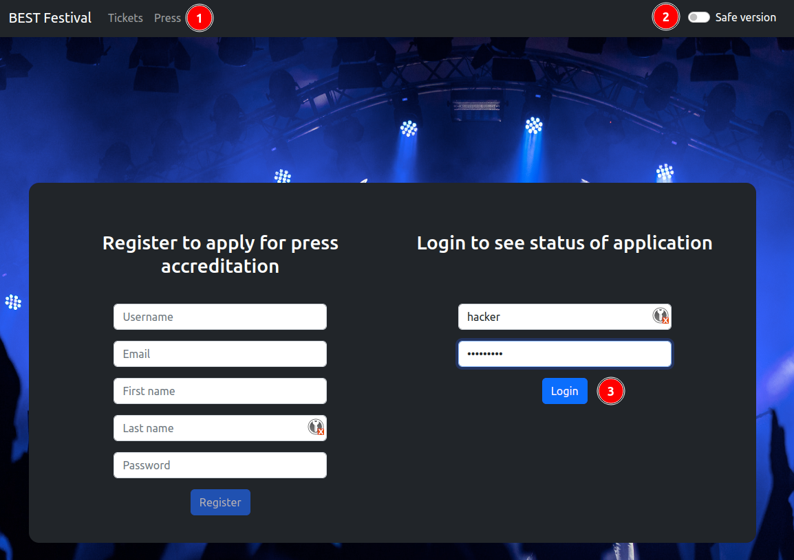

First thing we see is press application form. Let's fill some dummy data and
click Apply button.

  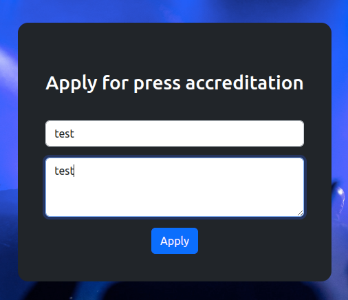

When press application is successfully created hacker can now open dev
console on the site to see how things works. First he can see, by looking at
network section, that to retrieve info about his application, there must be
some id provided in the url. He also sees that there must be token provided in
headers. 

  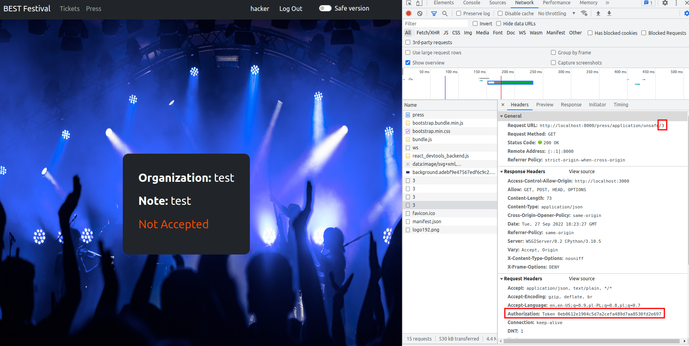

He doesn't know whether that number is user id or press application id, but he
knows that this number must be stored somewhere on the client side. He opens
local storage tab and sees that number three is stored as `user_id`. Now
hacker has everything to steal someone else accreditation.

  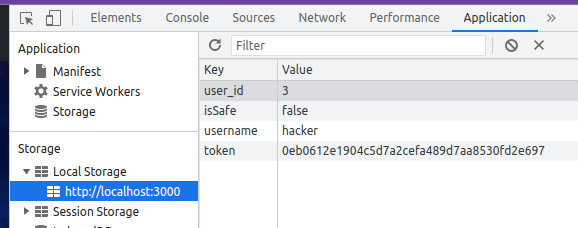

For this purpose hacker will use Postman, but any other similar software is
also good. If his `user_id` is 3, logic assumption is that fo user with id 2
there must be some press application.

  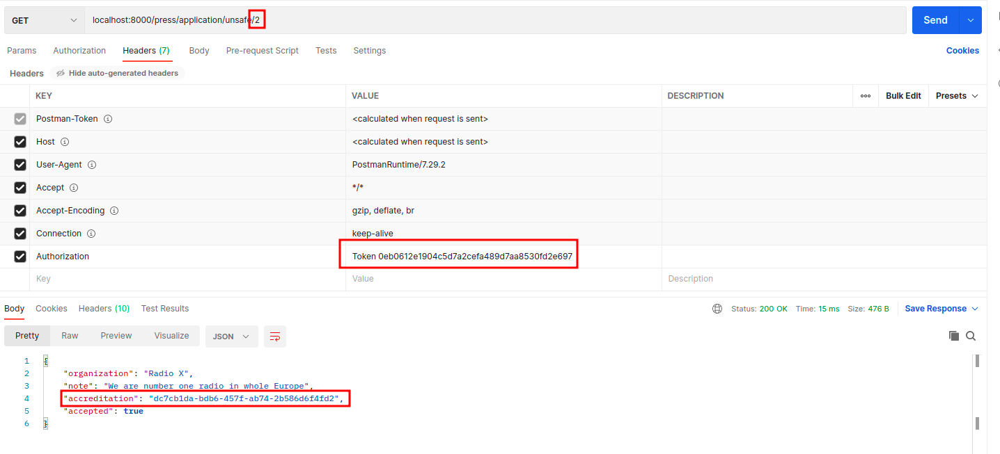

Voilà, attack was performed successfully. Hacker now have accreditation code 
of Radio X organization. 

### 4.1.2 Safe version of the app

In safe version of the app hacker would not be able to get someone else
accreditation, because API server match press application to user, based on
auth token which is sent in request header. For the implementation of unsafe
and safe endpoint take a look at 
`press_application.views.UnsafePressApplicationView` and
`press_application.views.SafePressApplicationView`

  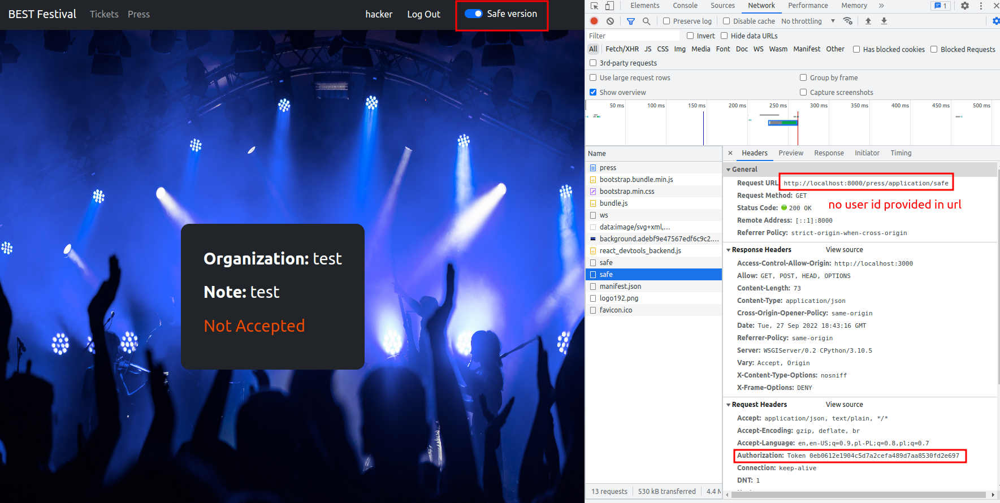

## 4.2 Password change for other user

### 4.2.1 Scenario in unsafe version of app

That is not all what hacker can perform with WPT. There is an account view
where user can update account info, including password change. Hacker can try
to change his own password and see how the request for password change looks
like.

  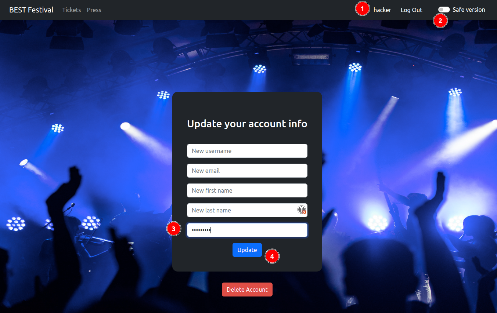

He can see that endpoint for account info update, like the get press
application endpoint, include user id in the url and password is sent in patch
payload. Now he can change password and username for the victim account to be
sure that they will not have their accreditation. That is lame. He can try to
change password of admin and have full control over application!

  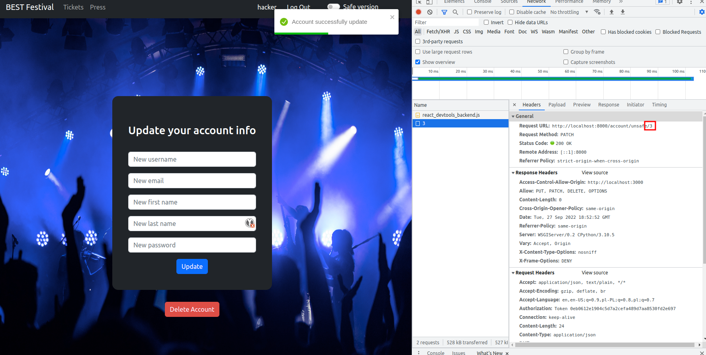

  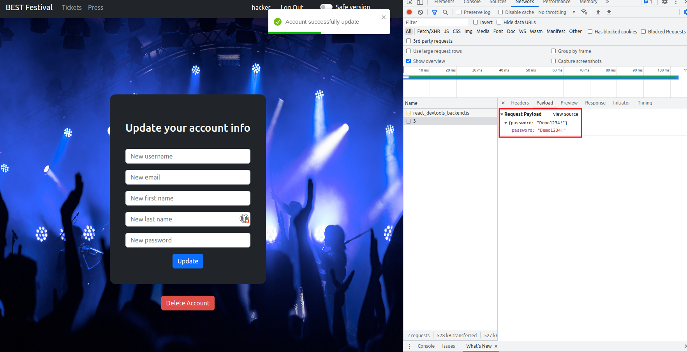

He is guessing that admin account has to have first user id(most commonly admin
account is first account created). He opens up Postman again, filling endpoint,
setting auth token and providing patch payload. To be sure that he can access
admin account he is also changing his username.

  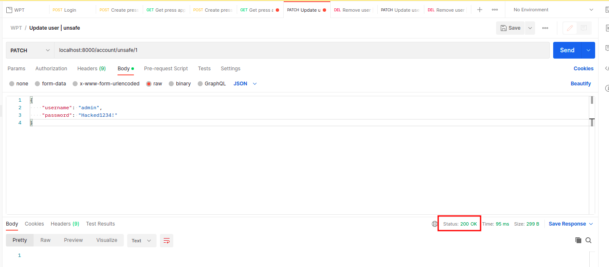

Voilà, attack was performed successfully. Hacker can now log in to admin. Url
is obvious(`/admin`), what a happy day for the hacker. Now he can see press
applications and for example he can also disable victim user to be sure that
victim has no access to his accreditation.

  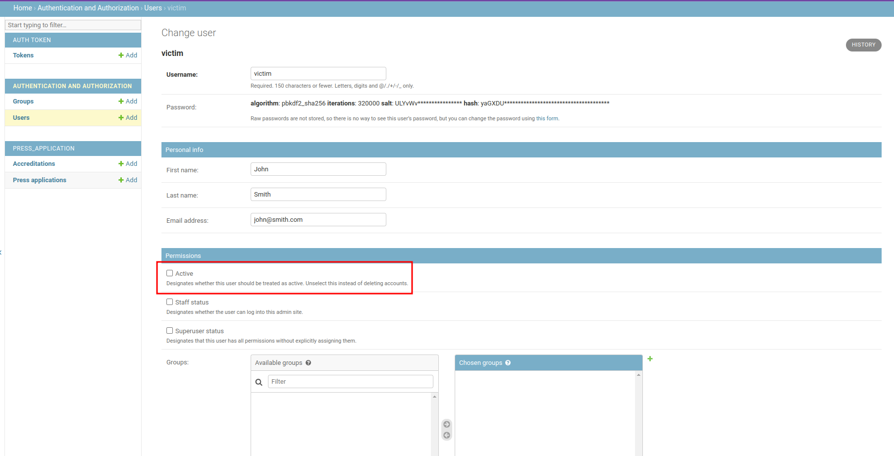

### 4.2.2 Safe version of app

Similarly to previous example, in safe version of application user is
identified by his auth token, so hacker is not able to change admin's password.
For the implementation of unsafe and safe endpoint take a look at 
`account.views.UnsafeUserView` and `account.views.SafeUserView`.

  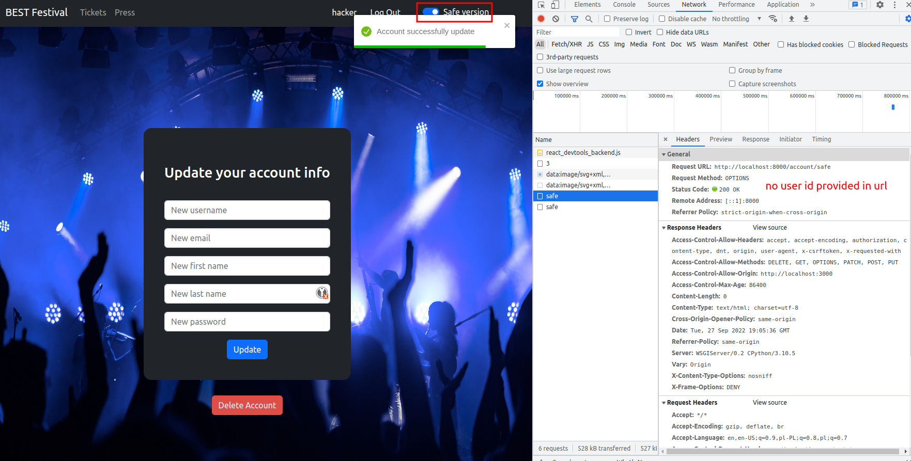

